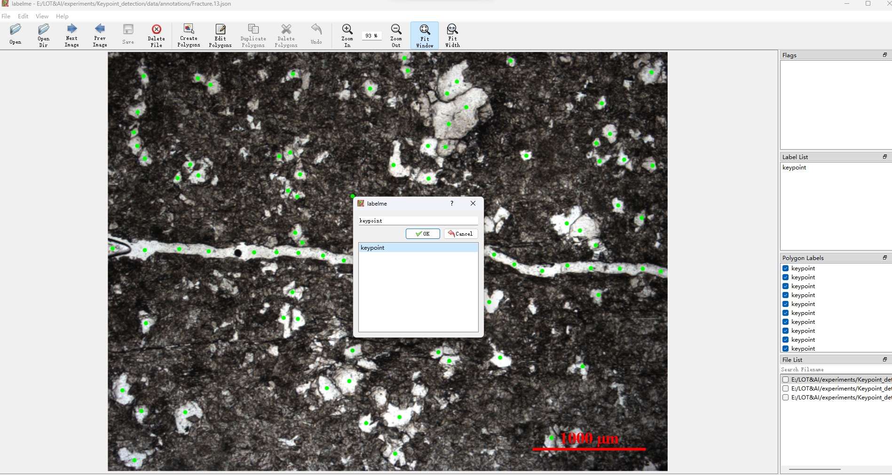

- # Project Name

  KeyPoint Detection Project

  ## Project Description

  This project is aimed at detecting keypoints in images using annotation tools and model training. By using the labelme tool, you can annotate the positions of keypoints in the images. Then, by running the Experimental_process.py script, you can obtain the test results for keypoint detection.

  python Experimental_process.py --split_num 2 --detection_num 2 --SIZE 512 512 --img_dir ./data/images/ --json_dir ./data/annotations/ --choose_model True --weights_pth ./weights/resnet101.pth --weights_onnx ./weights/camnet.onnx

  ## Installation

  Install the required Python dependencies using the following command:

  pip install labelme 

  

  ## Directory Structure

  The project directory structure is as follows:

  - data/                           # Data directory
    - images/                       # Original images directory
    - annotation/                   # Keypoint annotation JSON files directory
  - tools/                          # Tools directory
  - weights/                        # Model weights directory
  - Experimental_process.py         # Test script
  - README.md                       # Project documentation

    ## Usage

    Use the labelme tool to annotate keypoints in the images and save the annotation results in JSON files under the annotation directory.
    Run the Experimental_process.py script to perform keypoint detection and obtain the test results.

    ## Notes

    Make sure that all dependencies are installed.
    Ensure that the image annotation work is completed before running Experimental_process.py.